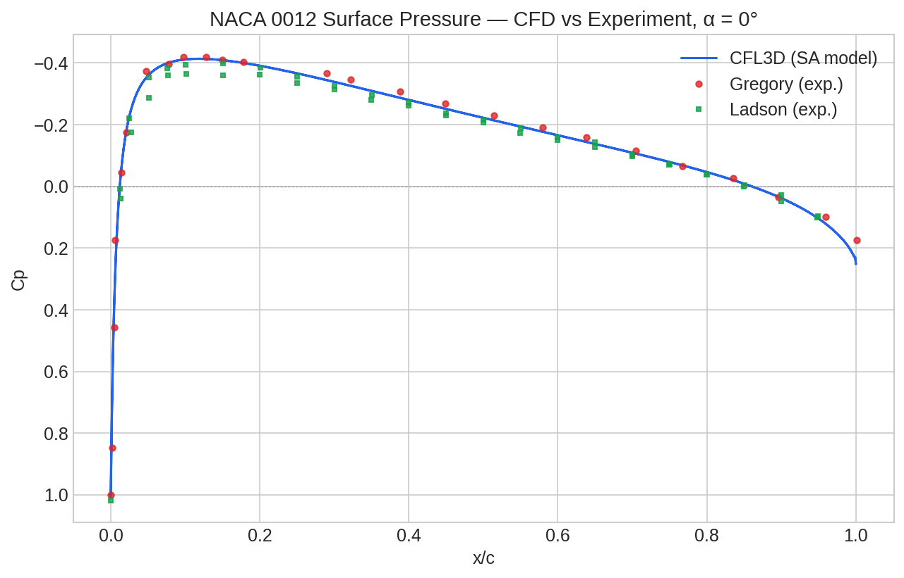
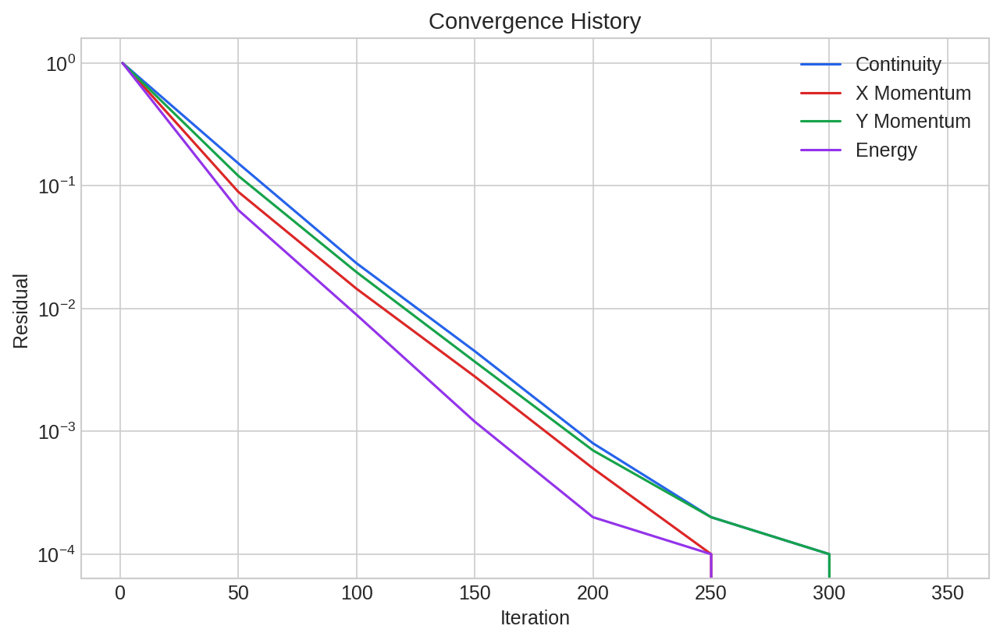
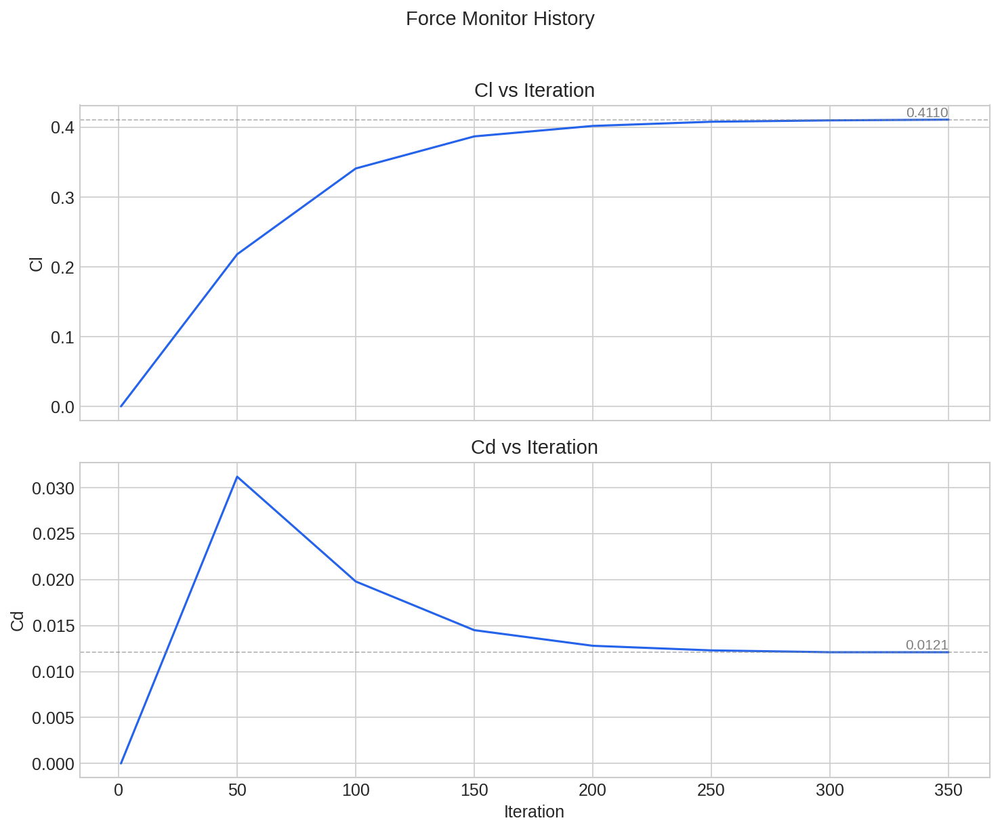

# aero-postprocess

python toolkit for automating CFD/FEA post-processing. reads simulation
outputs, generates publication-quality plots, and builds analysis reports
— replacing the manual Excel-and-screenshots workflow.

## The Problem

Engineers spend 2–4 hours per simulation run manually:

- exporting Ansys results to CSV
- copying data into Excel
- formatting plots by hand
- pasting screenshots into a Word doc

this toolkit does that in three lines of python.

## Example Output

### CFD vs Experiment Validation


*NACA 0012 surface pressure at α=0°. CFL3D SA model vs Gregory and Ladson experimental data (NASA TMR).*

### Convergence History



### Force Monitors



## Quick Start

```bash
git clone https://github.com/pjsroberts/aero-postprocess.git
cd aero-postprocess
python -m venv .venv && source .venv/bin/activate
pip install -r requirements.txt
PYTHONPATH=. python examples/demo.py
```

## Usage

```python
from src.parsers import read_surface_data, read_convergence, list_zones
from src.plots import plot_surface_cp, plot_convergence

# see what angles of attack are available
zones = list_zones("path/to/cfl3d_cp.dat")
print(zones)  # ['alpha=0', 'alpha=4', 'alpha=8', ...]

# parse CFD results and experimental data
cfd = read_surface_data("path/to/cfl3d_cp.dat", zone=0)
exp = read_surface_data("path/to/experimental_cp.dat", zone=0)

# overlay CFD vs experiment
plot_surface_cp(
    datasets=[
        {"df": cfd, "x_col": "x", "cp_col": "cp", "label": "CFD", "style": "-"},
        {"df": exp, "x_col": "x/c", "cp_col": "cp", "label": "Experiment", "style": "o"},
    ],
    output="cp_comparison.png",
)

# convergence history
conv = read_convergence("path/to/convergence.csv")
plot_convergence(conv, output="convergence.png")
```

## Supported Formats

| Format | Status |
|--------|--------|
| Tecplot ASCII (CFL3D, Ansys) | ✅ |
| Generic CSV/TSV | ✅ |
| XFOIL polar files | ✅ |
| Ansys force reports | ✅ |
| Multi-zone (multiple AoA) | ✅ |
| OpenFOAM postProcessing logs | 🔜 |

## Stack

python · numpy · scipy · matplotlib · pandas

## License

MIT
